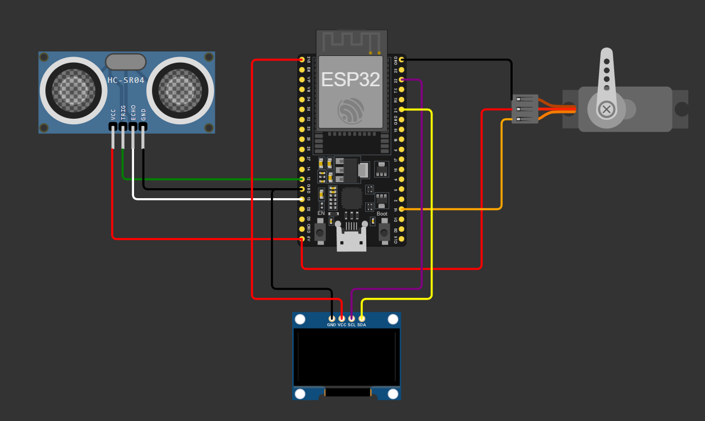
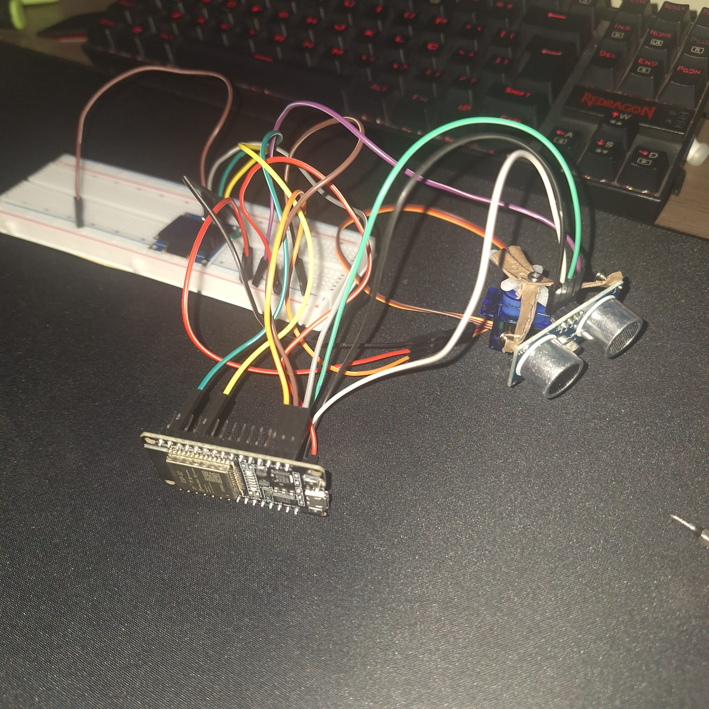

# Radar Ultrassônico com Varredura Automática – ESP32

Este projeto utiliza um ESP32, um sensor ultrassônico HC-SR04, um servo motor SG90 e um display OLED para simular um radar capaz de escanear o ambiente de forma automática.

## 🔧 Componentes utilizados

- ESP32
- Sensor ultrassônico HC-SR04
- Servo motor SG90
- Display OLED 0.96" I2C
- Protoboard e jumpers
- Suporte físico improvisado (papelão)

## ⚙️ Funcionamento

- O servo gira de 0° a 180°.
- Em cada ângulo, o sensor HC-SR04 mede a distância até um obstáculo.
- A leitura é exibida em tempo real no display OLED.
- O sistema usa lógica de controle com `millis()` para varredura fluida.

## 🧠 Aprendizados envolvidos

- Controle de servo motor com ESP32
- Leitura de distância com sensor HC-SR04
- Comunicação via I2C com Display OLED
- Uso de bibliotecas gráficas (Adafruit GFX e SSD1306)
- Organização do código por funções e controle com `millis()`
- Fixação mecânica improvisada e prototipagem rápida

## 📘 Bibliotecas utilizadas

- `ESP32Servo.h`
- `Wire.h`
- `Adafruit_SSD1306.h`
- `Adafruit_GFX.h`

Instaláveis diretamente pela Library Manager da IDE Arduino.

## 🖼️ Montagem do circuito

## 👨‍💻 Autor

Projeto desenvolvido por Enrike Rocha Fernandes – estudante de Engenharia de Controle e Automação.  
Foco em sistemas embarcados, automação prática e domínio completo dos conceitos através da prática manual.

---

## 🖼️ Imagem do projeto

---

📌 Este projeto foi desenvolvido **sem uso de códigos prontos**, com foco em **compreensão total de cada linha**.
